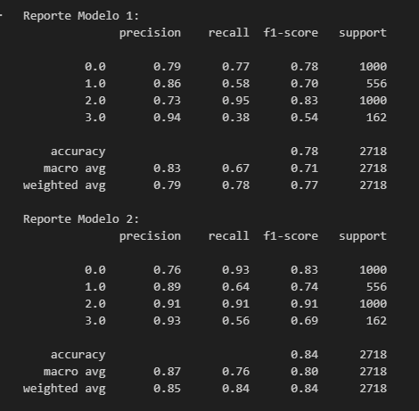

# SIC25-The-Debuggers


## IA para Análisis de Electrocardiogramas (ECG)

Este proyecto tiene como objetivo desarrollar una solución de inteligencia artificial para el análisis de electrocardiogramas utilizando datos de la **MIT-BIH Arrhythmia Database**. El pipeline del proyecto abarca la conversión de señales ECG a imágenes, la creación de un DataFrame con las etiquetas correspondientes, la división de los datos en conjuntos de entrenamiento y validación, y el entrenamiento de una red neuronal convolucional (CNN) creada desde 0 y el reentrenamiento de la CNN VGG16; esto con el fin de la clasificación de latidos.

## **Tecnologías utilizadas**

- **TensorFlow & Keras** – Para el desarrollo
y entrenamiento de los modelos de deep learning.
- **Python & Pandas** – Para la manipulación y preprocesamiento de los datos.
- **OpenCV & ImageDataGenerator** – Para la preparación de las imágenes.
- **Flask/FastAPI** – Para la integración del chatbot.

## **Proceso de desarrollo**

 **Fuente del dataset:**
<https://www.kaggle.com/datasets/shayanfazeli/heartbeat/data>

 **Limpieza de datos**

<!-- markdownlint-disable MD036 -->
 **Manejo excepciones/control errores**


<!-- markdownlint-disable MD029 -->
**Estadísticos**




## **Arquitectura del Proyecto**

**Diagrama de Alto Nivel**


**Diagrama**


El sistema cuenta con dos modelos que trabajan en conjunto para mejorar la precisión de la clasificación:

1. **Modelo CNN personalizado**
   - Construido desde cero con capas convolucionales y técnicas de aumento de datos.
   - Entrenado para reconocer patrones en imágenes de ECG en escala de grises.

2. **Modelo basado en VGG16**
   - Utiliza transfer learning con la arquitectura VGG16 preentrenada.
   - Se han ajustado las últimas capas para mejorar la clasificación específica de ECG.

Ambos modelos generan predicciones que luego se combinan para dar un resultado final al usuario.

## Precisión

Los modelos han sido entrenados con un conjunto de datos de más de **12,500 imágenes** y logran una precisión superior al **80%** en validación.

**Precisión de nuestro modelo**


**Precisión de modelo preentrenado**


## **Flujo de trabajo**

1. El usuario sube una imagen de un ECG en el chatbot.
2. La imagen es preprocesada y enviada a ambos modelos.
3. Se generan predicciones y se combinan para obtener el resultado final.
4. El chatbot devuelve la clasificación de la imagen.

## **Cómo ejecutar el proyecto**

1. **Clonar el Repositorio:**

   ```bash
   git clone https://github.com/repositoriosHackaton/SIC25-The-Debuggers.git
   ```

2. **Conversión de ECG a Imágenes y Generación del CSV:**

   Ejecuta las celdas del notebook data/script_imagen:

   Este script extrae los segmentos de latidos, los guarda como imágenes organizadas por clase y genera el archivo `data_imagenes.csv`.

3. **Iniciar la página web**

   Ejecuta el script en la carpeta "ecg_project":

   ```bash
   python server.py
   ```
<!-- markdownlint-disable MD034 -->
   Esto iniciará el servidor local, una vez en funcionamiento ingresa a
   través de tu buscador con: http://127.0.0.1:8000/

<!-- markdownlint-disable MD029 -->
4. **Realizar predicción**

   Entra en la sección "chatbot", luego selecciona el botón para subir una imagen y elige la imagen de
   tu preferencia dentro de "data/imagenes_eg/.."

   ¡Envía la imagen y recibe tu predicción!

## **Equipo de Trabajo**
<!-- markdownlint-disable MD033 -->
<table>
   <thead>
      <tr>
         <th></th>
         <th><strong>Nombre</strong></th>
         <th><strong>GitHub</strong></th>
         <th><strong>Rol del equipo</strong></th>
      </tr>
   </thead>
   <tbody>
      <tr>
         <td>
            
         </td>
         <td>Adrian Sanchez</td>
         <td><a href="https://github.com/asm2202">asm2202</a></td>
         <td>Desarrollador</td>
      </tr>
      <tr>
         <td>
            
         </td>
         <td>Hector Colmenares</td>
         <td><a href="https://github.com/hectordacb">hectordacb</a></td>
         <td>Desarrollador</td>
      </tr>
      <tr>
         <td>
            
         </td>
         <td>Jorge Morales</td>
         <td><a href="https://github.com/mordacay">mordacay</a></td>
         <td>Desarrollador</td>
      </tr>
      <tr>
         <td>
            
         </td>
         <td>Maeva Puente</td>
         <td><a href="https://github.com/msathiu">msathiu</a></td>
         <td>Desarrollador</td>
      </tr>
      <tr>
         <td>
            
         </td>
         <td>Manuel Maldonado</td>
         <td><a href="https://github.com/manumaldonado">manumaldonado</a></td>
         <td>Desarrollador</td>
      </tr>
   </tbody>
</table>
<!-- markdownlint-enable MD033 -->

## **Nota**

- Asegúrate de que la estructura de carpetas se mantenga igual para evitar errores en la ejecución de los scripts.

## **Contribuciones y Agradecimientos**

¡Las contribuciones son bienvenidas! Si tienes sugerencias o mejoras, por favor crea un _pull request_ o abre un _issue_.

**¡Gracias por visitar nuestro proyecto! Si tienes alguna pregunta o necesitas asistencia, no dudes en contactar.**

## **Licencia**

Este proyecto se distribuye bajo la licencia [MIT](LICENSE)
